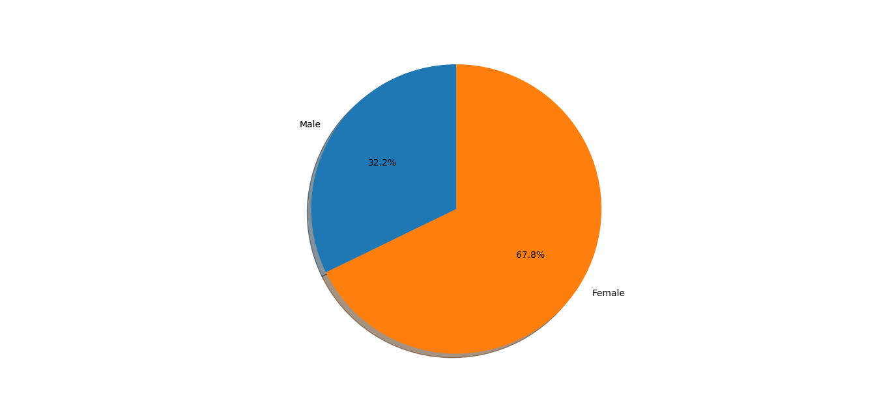

# Project Overview

This Python application processes a cleaned-up Excel dataset derived from a survey that compares male and female responses. 
The goal of the application is to use Pandas and Matplotlib to generate various visualizations, such as pie charts and other graphs, to effectively illustrate the data insights.

## Installation Instructions

1. Ensure Python is installed on your system. If not, download and install it from the [official Python website](https://www.python.org/downloads/).
2. Install required Python packages using pip:
	- pip install pandas
	- pip install matplotlib
	
3. Navigate to the directory containing the cloned repository via the command line. For example:
	- cd path_to_your_repository

4. Run the Python script:
	- python your_script_name.py

## Example Output

Below is an example of the visualizations created by this application:

